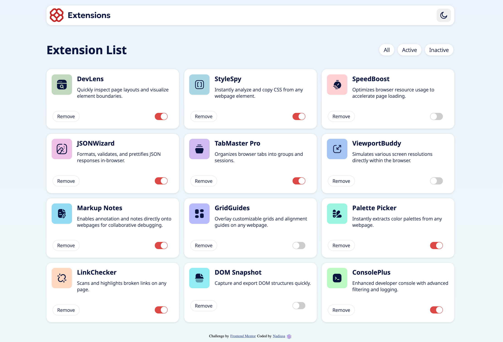
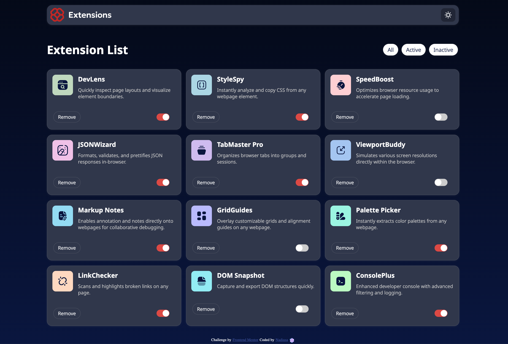

# Browser extensions manager UI solution

This is a solution to the [Browser extensions manager UI challenge on Frontend Mentor](https://www.frontendmentor.io/challenges/browser-extension-manager-ui-yNZnOfsMAp). Frontend Mentor challenge helped me improve my coding skills by building this realistic project. 

## Table of contents

- [Overview](#overview)
  - [The challenge](#the-challenge)
  - [Screenshot](#screenshot)
  - [Links](#links)
- [My process](#my-process)
  - [Built with](#built-with)
  - [What I learned](#what-i-learned)
  - [Continued development](#continued-development)
  - [Useful resources](#useful-resources)
- [Author and Acknowledgements](#author)

## Overview

### The challenge

Users are able to:

- Toggle extensions between active and inactive states
- Filter active and inactive extensions
- Remove extensions from the list
- Select their color theme
- View the optimal layout for the interface depending on their device's screen size
- See hover and focus states for all interactive elements on the page

### Screenshot

### Links

- Example URL: [Frontend Mentor](https://www.frontendmentor.io/challenges/browser-extension-manager-ui-yNZnOfsMAp)
- Solution/Live site URL: [Browser Extension Manager UI](https://www.frontendmentor.io/challenges/browser-extension-manager-ui-yNZnOfsMAp)

## My process

### Built with

- Semantic HTML5 markup
- CSS custom properties
- Flexbox
- CSS Grid
- Responsive design workflow

### What I learned

It was challenging for me to improve the interactive part of this website. All JavaScript implemented was a huge refresh of my knowleges. I've used fetching data from given data.json file to build all extensions card and their description. Also added interactive features using event listeners  and other facilities offered by js.

### Continued development

Going to improve my js skills and focus more on learning js frameworks and libraries.

### Useful resources

- [W3schools](https://www.w3schools.com/) 
- [CSS Toggles](https://csstoggles.github.io/) 
- [CSS Scan](https://getcssscan.com/css-box-shadow-examples)
- [Bootstrap](https://getbootstrap.com/)
- [MDN Documentation](https://developer.mozilla.org/)

## Authors and Acknowledgements

- Author - [@nadejda-g](https://github.com/nadejda-g)
- Template - [@Frontend Mentor](https://www.frontendmentor.io)
- Mentor - [@dragomirt](https://github.com/dragomirt)
